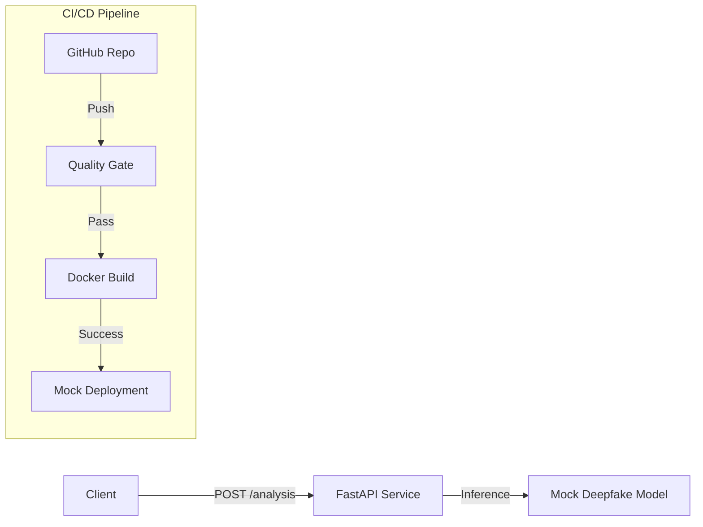

# Deepfake Detection Microservice


A production-grade microservice for analyzing media content to detect deepfakes. This project demonstrates a complete **DevOps Lifecycle**, featuring automated testing, containerization, and a CI/CD pipeline targeting cloud deployment.

## 🏗️ Architecture

The system follows a modern microservice architecture, packaged in Docker and automated via GitHub Actions.



## 🚀 Key Features

*   **RESTful API**: Built with FastAPI for high performance.
*   **Mock ML Inference**: Simulates realistic model latency and confidence scoring.
*   **Professional Logic**: Structured response models with metadata.
*   **Quality Assurance**: Integrated `pytest`, `flake8`, and `black` for code quality.
*   **Containerized**: Production-ready `Dockerfile` using multi-stage best practices.
*   **CI/CD**: Full GitHub Actions workflow for Test -> Build -> Deploy.

## 🛠️ Tech Stack

*   **Language**: Python 3.9
*   **Framework**: FastAPI + Uvicorn
*   **Testing**: Pytest + TestClient
*   **Container**: Docker
*   **CI/CD**: GitHub Actions
*   **Deployment Target**: Railway (Mock/Planned)

## 📦 Project Structure

```bash
├── .github/workflows   # CI/CD Pipeline Definitions
├── services/
│   └── deepfake-api/   # Microservice Source Code
│       ├── app/
│       │   ├── api/    # Route Controllers
│       │   ├── core/   # Config & Settings
│       │   ├── services/ # Business Logic & Models
│       │   └── main.py # Entry Point
│       ├── tests/      # Unit & Integration Tests
│       ├── Dockerfile  # Container Definition
│       └── requirements.txt
└── README.md
```

## ⚡ Quick Start (Local)

### 1. Prerequisites
- Python 3.9+
- Docker (Optional)

### 2. Run with Python

```bash
# Navigate to the service
cd services/deepfake-api

# Install dependencies
pip install -r requirements.txt

# Run the server
uvicorn app.main:app --reload
```

Access the API documentation at: `http://localhost:8000/docs`

### 3. Container Registry Configuration (Docker Hub)

1.  **Get Docker Hub Token**:
    - Log in to [Docker Hub](https://hub.docker.com/).
    - Go to **Account Settings** -> **Security**.
    - Click **New Access Token**.
    - Description: `GitHub Actions`.
    - Permissions: Read, Write, Delete.
    - Copy the generated token.

2.  **Add Secrets to GitHub**:
    - Go to your GitHub Repo -> **Settings** -> **Secrets and variables** -> **Actions**.
    - Add **New repository secret**:
        - `DOCKER_USERNAME`: Your Docker Hub username.
        - `DOCKER_PASSWORD`: The Access Token you just copied.

## 🤖 CI/CD Pipeline

### 4. Deployment Configuration (Render)

1.  **Create Service**:
    - Go to [Render Dashboard](https://dashboard.render.com/).
    - Click **New +** -> **Web Service**.
    - Select **"Deploy from Docker Registry"**.
    - Image URL: `<your-docker-username>/deepfake-api:latest`.
    - Name: `deepfake-api`.
    - Plan: **Free**.
    - Click **Create Web Service**.

2.  **Get Deploy Hook**:
    - Click on your new service.
    - Go to **Settings** -> **Build & Deploy**.
    - Find **"Deploy Hook"**.
    - Click **Copy**. (It looks like `https://api.render.com/deploy/srv-...`).

3.  **Add to GitHub**:
    - Go to your GitHub Repo -> **Settings** -> **Secrets and variables** -> **Actions**.
    - Add **New repository secret**:
        - `RENDER_DEPLOY_HOOK`: Paste the URL you copied.

## 🤖 CI/CD Pipeline

The pipeline is defined in `.github/workflows/main.yml`:

1.  **Quality Gate**: Linting and Testing.
2.  **Build & Push**: Pushes Docker image to Docker Hub.
3.  **Deploy**: Triggers Render to pull the new image and update the live site.


---
**Author**: Neeraj Chandra Nakka

