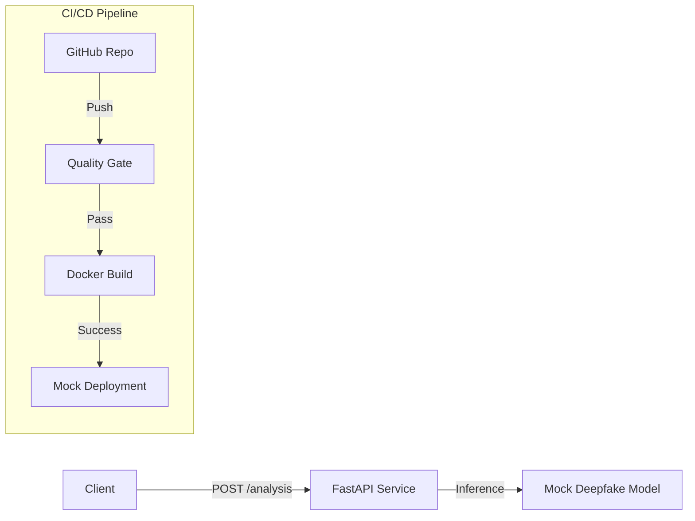

# Deepfake Detection Microservice


A production-grade microservice for analyzing media content to detect deepfakes. This project demonstrates a complete **DevOps Lifecycle**, featuring automated testing, containerization, and a CI/CD pipeline targeting cloud deployment.

## 🏗️ Architecture

The system follows a modern microservice architecture, packaged in Docker and automated via GitHub Actions.



## 🚀 Key Features

*   **RESTful API**: Built with FastAPI for high performance.
*   **Mock ML Inference**: Simulates realistic model latency and confidence scoring.
*   **Professional Logic**: Structured response models with metadata.
*   **Quality Assurance**: Integrated `pytest`, `flake8`, and `black` for code quality.
*   **Containerized**: Production-ready `Dockerfile` using multi-stage best practices.
*   **CI/CD**: Full GitHub Actions workflow for Test -> Build -> Deploy.

## 🛠️ Tech Stack

*   **Language**: Python 3.9
*   **Framework**: FastAPI + Uvicorn
*   **Testing**: Pytest + TestClient
*   **Container**: Docker
*   **CI/CD**: GitHub Actions
*   **Deployment Target**: Railway (Mock/Planned)

## 📦 Project Structure

```bash
├── .github/workflows   # CI/CD Pipeline Definitions
├── services/
│   └── deepfake-api/   # Microservice Source Code
│       ├── app/
│       │   ├── api/    # Route Controllers
│       │   ├── core/   # Config & Settings
│       │   ├── services/ # Business Logic & Models
│       │   └── main.py # Entry Point
│       ├── tests/      # Unit & Integration Tests
│       ├── Dockerfile  # Container Definition
│       └── requirements.txt
└── README.md
```

## ⚡ Quick Start (Local)

### 1. Prerequisites
- Python 3.9+
- Docker (Optional)

### 2. Run with Python

```bash
# Navigate to the service
cd services/deepfake-api

# Install dependencies
pip install -r requirements.txt

# Run the server
uvicorn app.main:app --reload
```

Access the API documentation at: `http://localhost:8000/docs`

### 3. Run with Docker

```bash
# Build the image
docker build -t deepfake-api ./services/deepfake-api

# Run the container
docker run -p 8000:8000 deepfake-api
```

## 🤖 CI/CD Pipeline

The pipeline is defined in `.github/workflows/main.yml` and consists of three stages:

1.  **Quality Gate**: Runs `black` (checking), `flake8` (linting), and `pytest` (unit tests). Fails immediately if standards are not met.
2.  **Build Artifact**: Builds the Docker container and tags it with the commit SHA for traceability.
3.  **Deploy (Staging)**: Simulates a deployment to a PaaS provider (e.g., Railway).

## 🔮 Future Roadmap

- [ ] **Real AI Model**: Replace the mock service with a TensorFlow/PyTorch model.
- [ ] **Railway Deployment**: Connect GitHub repo to Railway for live URL.
- [ ] **DB Integration**: PostgreSQL for storing analysis history.

---
**Author**: Neeraj Chandra Nakka
**License**: MIT
