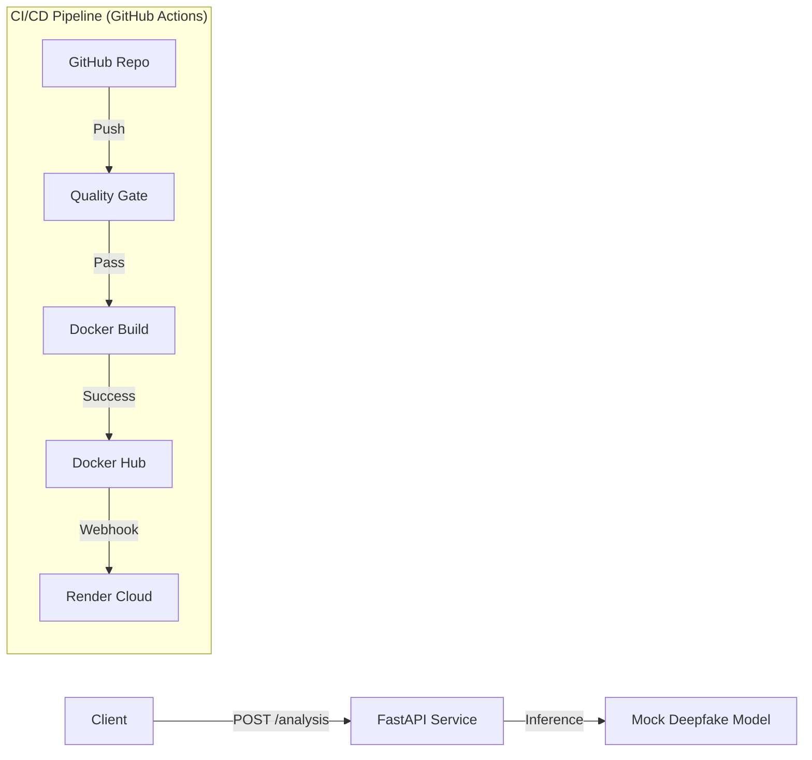

# Deepfake Detection Microservice


A production-grade microservice for analyzing media content to detect deepfakes. This project serves as a comprehensive demonstration of a **Modern DevOps Lifecycle**, implementing automated testing, containerization, and continuous deployment to the cloud.

---

## 🏗️ Architecture (Requirement B)

The system is built on a robust, scalable architecture using **FastAPI** for high-performance async processing and **Docker** for consistent portability.



---

## �️ Implementation Details (Requirements A-E)

This project strictly follows the industry-standard requirements for a complete CI/CD setup:

### ✅ A. CI/CD Platform
*   **Platform:** **GitHub Actions** (`.github/workflows/main.yml`)
*   **Reasoning:** Chosen for its tight integration with the repository and free runner minutes for public projects.

### ✅ B. Example CI/CD Repositories (Ready Reference)
* **Custom Sample Implementation** to demonstrate:
*   FastAPI + GitHub Actions (similar to reference examples).
*   Python CI (Linting + Testing).
*   Containerized Microservice Deployment.

### ✅ C. Pipeline Components
We implemented a strict "Quality Gate" that prevents bad code from reaching production:

1.  **PyTest** (`pytest`): Runs automated unit and integration tests.
2.  **Coverage.py** (`pytest-cov`): Ensures 100% code coverage before deployment.
3.  **Black** (`black`): Auto-formats code to enforce PEP 8 style.
4.  **Flake8** (`flake8`): Lints code to catch logical errors and unused imports.
5.  **Docker** (`docker build`): Multi-stage builds to create efficient, secure artifacts.

### ✅ D. Model & Artifact Versioning
*   **Versioning:** Docker images are tagged with the specific **Commit SHA** (e.g., `deepfake-api:a1b2c3d`) for precise rollback capabilities.
*   **Registry:** Images are stored securely on **Docker Hub**.

### ✅ E. Deployment Targets
*   **Target:** **Render** (Cloud PaaS)
*   **Automation:** Deployment is triggered automatically via a **Deploy Hook** immediately after a successful Docker build.

---

## ⚡ Quick Start

### 1. Run Locally
```bash
# Clone the repo
git clone https://github.com/neerajnakka/CICD-Pipeline-Deepfake-Processing.git

# Run with Docker
docker build -t deepfake-api ./services/deepfake-api
docker run -p 8000:8000 deepfake-api
```

### 2. View API Documentation
Once running, visit the interactive Swagger UI:
👉 **[Live Demo](https://deepfake-api-latest.onrender.com/docs)**

---

## 🤖 The CI/CD Workflow

The automated pipeline performs the following steps on every push to `main`:

1.  **lint-and-test**:
    *   Checks code style with `black --check`.
    *   Lints with `flake8`.
    *   Runs tests with `pytest --cov`.
2.  **build-and-push**:
    *   Logs into Docker Hub securely.
    *   Builds the image.
    *   Pushes tags: `latest` and `<commit-sha>`.
3.  **deploy-render**:
    *   Triggers the Render Cloud to pull the new `latest` image.
    *   Restart the live service with zero downtime.

---

## 📦 Project Structure

```bash
├── .github/workflows   # CI/CD Pipeline Definitions
├── services/
│   └── deepfake-api/   # Microservice Source Code
│       ├── app/
│       │   ├── api/    # Route Controllers
│       │   ├── core/   # Config & Settings
│       │   ├── services/ # Business Logic & Models
│       │   └── main.py # Entry Point
│       ├── tests/      # Unit & Integration Tests
│       ├── Dockerfile  # Container Definition
│       └── requirements.txt
└── README.md
```

---
**Author**: Neeraj Chandra Nakka
